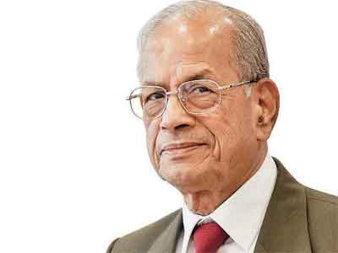

## E Sreedharan

Projects require you to perform at your best and deliver in short timelines. You can't make excuses or mess up with the timelines. 

E Sreedharan popularly known as the "Metro Man" has been one such figure who has consistently delivered projects like Delhi and Kolkatta metro before timelines and high efficiency. He was also awarded Padma Vibhushan by the Indian Government and was appointed by UN Secretary General Ban Ki-moon to serve on the United Nations's High Level Advisory Group on Sustainable Transport (HLAG-ST) for a period of three years.

**This repository has many projects that you can use for learning.**

## Hangman
Popularly known as Hangman, this is a guessing game that a lot of us may have played while we were kids. We will start from a basic implementation and improve it along the way to make a game that we can show-off to our friends.

## KBC
Popularly known as KBC, "Kaun Banega Crorepati" has one of the most famous TV Shows. Hosted by Amitabh Bacchan show became a household name and aspiration. We are going to develop this game further and add many features to it.